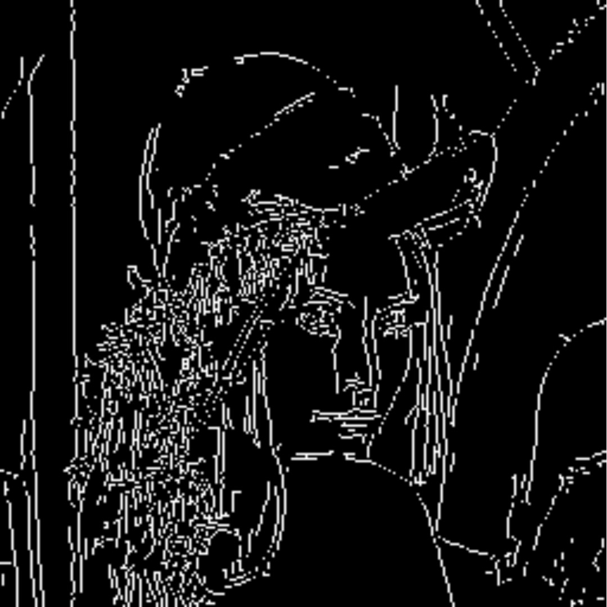
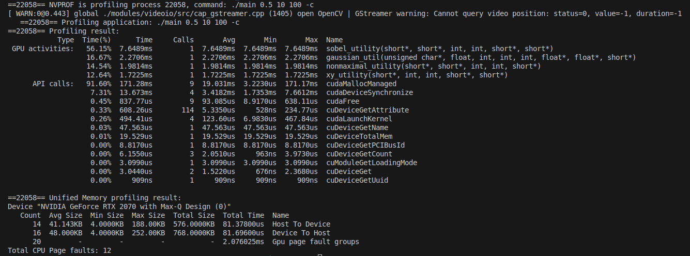
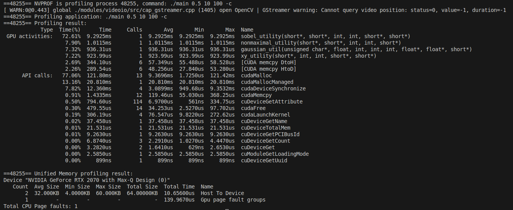
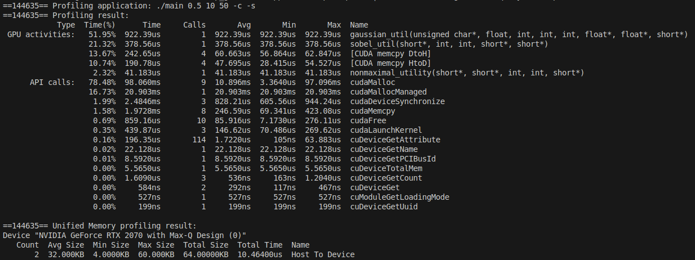

# Canny_Edge
The purpose of this repository is to implement the steps of canny edge detection. 

## Dependencies
* [cmake](https://cmake.org/download/)
* [OpenCV](https://opencv.org/get-started/)
* [cuda (optional)](https://developer.nvidia.com/cuda-toolkit)

## Usage
To build the program, run the following commands:
```
cmake -S . -B build
cmake --build build
```
To enable cuda/multithreading:
```
cmake -D ENABLE_CUDA=ON build
```
The program can then be run by the following:
```
cd build/src
./Main {sigma} {minVal} {maxVal}
```
**Parameters:**
* sigma: the standard deviation used by the gaussian blurring function to generate the gaussian kernel
* minVal: the minimum value for a pixel during the hysteresis step (0-255)
* maxVal: the maximum value for a pixel during the hysteresis step (0-255)
* -s: show steps of process
* -c: use cuda functions if cuda is enabled
## Example
<p align="center">
    
    
    
    
    
</p>

1. **Gaussian Blurring:** The image is first changed to a grayscale image. To remove noise that can affect edge detection, a gaussian filter is applied to the image. A gaussian filter is generated as a function of the provided sigma value, and is used to smooth the image.

2. **Gradient Calculation:** The edges were then found by using the Sobel edge detection operator. The derivative in the horizontal and vertical direction were found separately. The resulting derived images were combined to find the edge gradient magnitude and direction using the equations: $G = \sqrt(G_x^2 + G_y^2)$, $\theta = \text{arctan}2(G_y,G_x)$

3. **Nonmaximal Suppression:** Nonmaximal suppression was used to thin the edges. Based on the gradient direction, it was classified as going in the North/South, East/West, Northwest/Southeast, or Northeast/Southwest direction. The gradient of the neighboring pixels in the classified direction were then checked. If the gradient at the pixel was not larger than both of its neighbors, the value of the pixel was set to 0. 

4. **Hysteresis Thresholding:** Lastly, hysteresis thresholding was used to keep strong edges and remove weak edges. Using the provided minVal and maxVal, any edges with a value lower than minVal was set to 0, and any edge higher than maxVal was set to the maximum value (255). Edges that fell between the two threshold values were classified based on if they touched a strong edge. Edges that touch a strong edge were set to the maximum value and were from then on considered as strong edges, while edges that did not touch strong edges were set to 0. 

## Optimizations
In order to reduce the time spent computing the filtered image, [NVIDIA's CUDA platform](https://developer.nvidia.com/cuda-toolkit) was used to implement multithreading features. An NVIDIA RTX 2070 was used, limiting the compute capability to 7.5. Several optimizations were made, with the profiling results shown below.

### Initial Parallelization
The initial experiments involved using basic features from CUDA. Global memory was allocated using cudaMallocManaged(), and each thread was responsible for one pixel in the whole image. A grid-stride loop was used to ensure coverage of all of the image's pixels. The gaussian(), xy_gradient(), sobel(), and nonmaximal() functions were parallelized. This experiment was done with 3 thread blocks, with 512 threads each. 

<p align="center">
    
</p>

### Improved Memory Allocation
To improve the performance when copying data from the CPU to the GPU, the next experiment replaced cudaMallocManaged() with cudaMalloc(). A minor speedup was observed in functions. This experiment was done with 3 thread blocks, with 512 threads each. 

<p align="center">
    
</p>

## Tiling
The last experiment was to implement tiling to improve performance. Tiling involves using shared memory, which is significantly faster for thread blocks to access versus global memory. Shared memory is shared by each thread within a thread block. To perform tiling, each thread block is responsible for a portion of the image. The section of the image is saved to shared memory, and threads access the shared memory to peform the necessary calculations. The benefits of shared memory compound when functions have calculations that require repeated access to the same image pixel. Note that the image must be broken up into tiles due to shared memory typically being very small. This experiment was done with 20 thread blocks, with 32 threads each. 

In order to implement tiling, the xy_gradient() and sobel() functions were combined into a single function. Tiling was then applied to the sobel() and nonmaximal() functions. The result of this was an extreme drop in running time for these functions. Despite using less than half the total number of threads, the speedup from using shared memory was far more significant than just utilizing more threads to process more pixels at a time. 

<p align="center">
    
</p>

